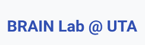
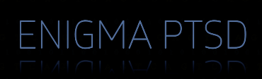
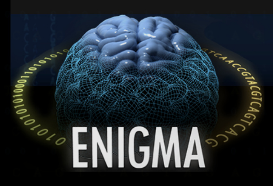
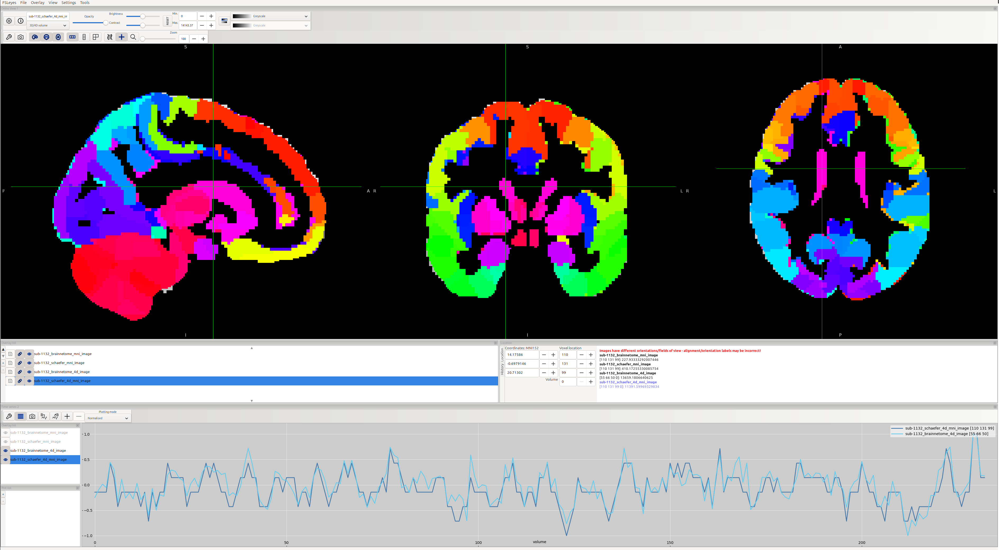

<table align="center" border="0" cellpadding="0" cellspacing="0" style="border: none; border-collapse: collapse;">
  <tr>
    <td align="center" style="border: none; padding-right:24px;">
      <a href="https://brainlab-uta.github.io/BRAIN-Lab/team.html" target="_blank" rel="noopener noreferrer">
        
      </a>
    </td>
    <td align="center" style="border: none; padding-right:24px;">
      <a href="https://enigma.ini.usc.edu/ongoing/enigma-ptsd-working-group/" target="_blank" rel="noopener noreferrer">
        
      </a>
    </td>
    <td align="center" style="border: none; padding-right:24px;">
      <a href="https://enigma.ini.usc.edu/" target="_blank" rel="noopener noreferrer">
        
      </a>
    </td>
  </tr>
</table>

<h1 align="center">ENIGMA-PTSD</h1>
<h2  align="center"> 3D/4D parcellated image generation </h2>
  
<p align="center">
   Codes for pre-processing, dataloader creating, and Self-Supervised Learning evaluation over current ENIGMA-PTSD dataset. For accessing ENIGMA-PTSD data please contact contact <a href="mailto:xi.zhu@uta.edu" target="_blank" rel="noopener noreferrer"> <b>Dr. Xi Zhu</b></a>.
</p>

This repository contains:
- **Preprocessing pipelines** to generate in this [folder](https://github.com/BRAINLAB-UTA/ENIGMA-PTSD/tree/main/preprocessing):
  - structural features (sMRI-derived)
  - fALFF/ReHo (rs-fMRI-derived)
  - RSData (resting-state 4D time-series–derived)
- **Dataloader creation utilities** for downstream SSL evaluation/training in this [folder](https://github.com/BRAINLAB-UTA/ENIGMA-PTSD/tree/main/SSL_evaluation).

For start running the preprocessing and DataLoader creation follow the next steps in sequence:

## Quick start (environment)

### 1) Clone
```bash
git clone https://github.com/BRAINLAB-UTA/ENIGMA-PTSD.git
cd ENIGMA-PTSD
```

### 2) Create Python environment (Python version >= 3.11)

Please install **pip** before anything

Using **Conda**

```bash
conda create -n enigma-ptsd python=3.11 -y
conda activate enigma-ptsd
pip install -r requirements.txt
```

Using **venv**
```bash
python -m venv .venv
source .venv/bin/activate
pip install -r requirements.txt
```
### 3) Data generation (structural, fALFF/ReHo, RSData)

Here we describe the intended flow for producing the derived files needed by the dataloader.

You generally need (per subject) on each modality folder:
   - T1w anatomical image 3D NIfTI .nii.gz in the folder **Structural**
   - Resting-state fMRI (4D NIfTI) + metadata TR, etc written in .json files in the folder **RSData**
   - ALFF/fALFF/ReHO 3D images in the folder **falffReHo**
   - Site/subject mapping tables (IDs, site names), as used by the ENIGMA project in main **ENIGMA anotation spreadsheet**

The structure of each folder modality will be like this:

```text
/DATA_Modality/
  siteA/
    sub-XXXX/
        T1w.nii.gz
        rest.nii.gz
        falff_reho.nii.gz
  siteB/
    sub-YYYY/
      ...
```
This does not follow a standard BIDS format. Having different annotation per site and modality this code can handle.

#### Structural Images

To create the 3D structural images on the [**Destrieux**](https://nilearn.github.io/dev/modules/description/destrieux_surface.html) and [**Desikan-Killiany-Tourville (DKT)**](https://surfer.nmr.mgh.harvard.edu/fswiki/CorticalParcellation) atlases run the follow Python command in the [**preprocessing**](https://github.com/BRAINLAB-UTA/ENIGMA-PTSD/tree/main/preprocessing) folder

```python
python create_parcellation_structural.py
```
This codes generates three different type of 3D image in the **Structural** folder with **vol** (Volume), **thick** (Cortical Thickness), and **surf** (Surface) data and the corresponding suffixes per subject and site.

This command an take a couple of minutes, so be patient depending on the power of your CPU processing. **Take into account you must change the absolute or relative path directories for all the modalities before running this command and the following**. 

#### Resting state 4D images

For generating projected 4D images from [**Schaefer**](https://nilearn.github.io/dev/modules/description/schaefer_2018.html) and [**Brainnetome**](https://atlas.brainnetome.org/download.html) nii.gz images with the original resolution of the **MNI** mask **MNI152NLin2009cAsym** from **freesurfer** 193 x 215 x 193 for X, Y, Z voxel dimensions. For installing freesurfer select the adequate tarball [here](https://surfer.nmr.mgh.harvard.edu/fswiki/rel7downloads) and follow the instructions.

```python
python create_parcellation_images_mni.py
```

For creating alternative 4D images with **decimated factor** as an integer that resample the images on X, Y, Z voxels dimension you must run the following command 

```python
python create_parcellation_images_mni_smaller_resample.py <decimation_factor>
```

This code will generate the interim projected or projected/resampled images in the RSData folder with the corresponding Atlas suffix, such as, **schaefer** and **brainnetome** per subject and site. 

#### ALFF/fALFF/ReHO

This images are already derived from the **aCompcorOnly** folder there are not need to be processed before running the dataloader.

#### Visualization after image projection

For doing a visual QC process after the images are generated per site and subject

First install **FSL** following the steps in the officinal website [https://fsl.fmrib.ox.ac.uk/fsl/docs/install/](https://fsl.fmrib.ox.ac.uk/fsl/docs/install/).

For installing **FSL** download the [**fslinstaller.py**](https://fsl.fmrib.ox.ac.uk/fsldownloads/fslconda/releases/fslinstaller.py) file run this commands and set up a folder in your local machine to get the bin files.

```python
python fslinstaller.py
```

Now load the bin folder in your bashrc system using the .sh code [here](https://github.com/BRAINLAB-UTA/ENIGMA-PTSD/blob/main/fsl_load.sh) and running this. First locate where your **FSL** files are located in your local machine and modify the bash file with the right path.

```python
source fsl_load.sh
```
Now you can inspect the quality of your data using **fsleyes** following this bash command from the same subject and site having the absolute path of the 3D Structural, 4D RSData, and 3D falff.ReHo. The paths in the example are for site AMC

```bash
fsleyes ../../AMC/sub-1132/sub-1132_schaefer_4d_mni_image.nii.gz ../../AMC/sub-1132/sub-1132_schaefer_4d_image.nii.gz ../../AMC/sub-1132/sub-1132_schaefer_mni_image.nii.gz ../../AMC/sub-1132/sub-1132_brainnetome_mni_image.nii.gz ../../AMC/sub-1132/1132_Destrieux_thick_struct3D.nii.gz
```

<td align="center" style="border: none; padding-right:24px;">
      <a href="" target="_blank" rel="noopener noreferrer">
        
      </a>
</td>

Check the timeseries plots and the aligment of the different ROIs on each image to be sure the code is working as you expect.

After concatenating all subjects that define **RSData**, **Structural**, and **fALFF/ReHo** data we obtained a final overlap of **1668 subjects** for the sites ['Duke', 'Muenster', 'WacoVA', 'Capetown', 'AMC', 'Lawson', 'Vanderbilt', 'Ghent', 'MinnVA', 'Milwaukee', 'Emory', 'Masaryk', 'Beijing', 'UWash', 'Grupe', 'McLean', 'NanjingYixing', 'Tours', 'Toledo', 'Groningen']
